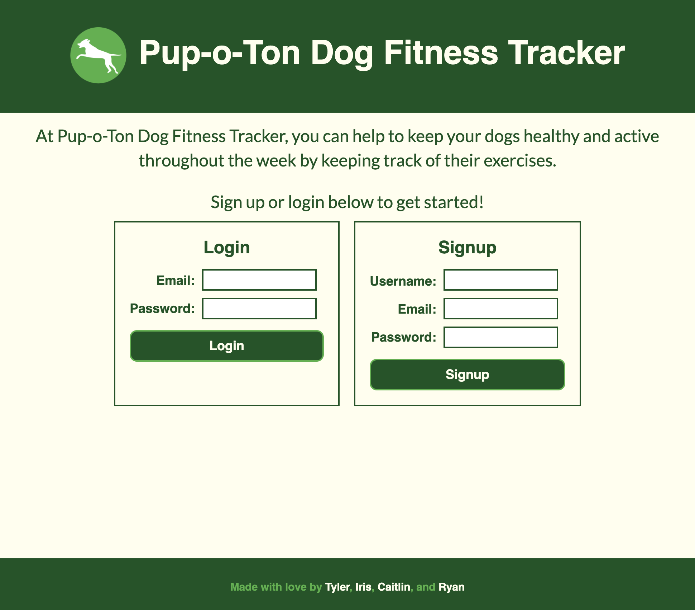

# pup-o-ton

## Description

A dog fitness tracker application that allows users to create a profile for their dog in order to view, create, and track their dog's exercise regimen. This is a React single-page application that uses a Mongo database with a Mongoose schema.

The image below is a preview of the application's appearance.



## Installation

To install necessary dependencies, run the following command:

```md
npm i
```